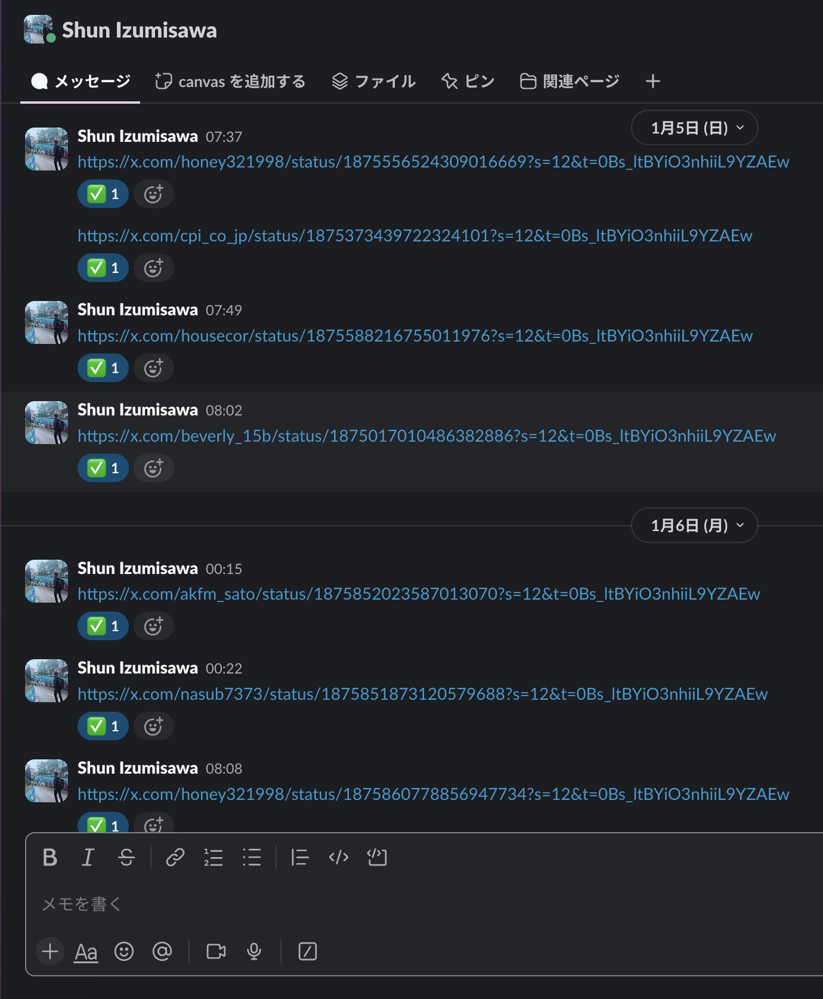
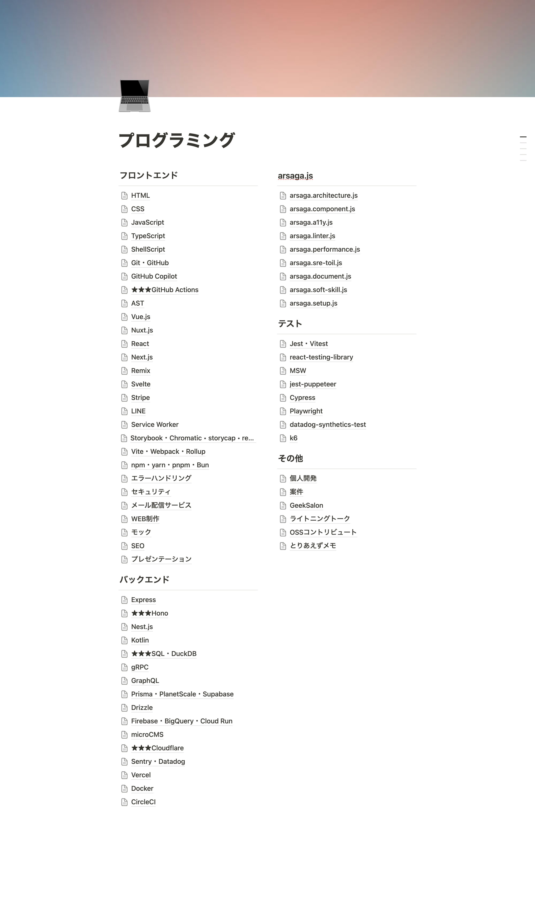

# 自分だけの「セカンドブレイン」を育もう

2025/01/24

# 背景・目的

- `SECOND BRAIN（セカンドブレイン）　時間に追われない「知的生産術」`を読んだ
- セカンドブレインを知らない方 -> 言葉だけでも覚えていって欲しい
- 知らずにセカンドブレインを運用している方 -> 体系化された形で定義されていることを共有したい
- 自分はどうやってセカンドブレインを育てているのか棚卸しをしたい

# セカンドブレインとは？

## 個人が情報やアイデアを整理・保存し、必要なときにすぐにアクセスできるようにするための外部の情報管理システムのこと

記憶や思考を補助する「第 2 の脳」として機能し、主にデジタルツールを使って構築する

- ノートアプリ: Notion、Evernote、Obsidian、Roam Research
- タスク管理ツール: Todoist、Trello
- クラウドストレージ: Google Drive、Dropbox

# セカンドブレインとは？

## 個人が情報やアイデアを整理・保存し、必要なときにすぐにアクセスできるようにするための外部の情報管理システムのこと

「整理・保存し、必要なときにすぐにアクセスできるようにする」ために CODE というフレームワークを使う

- Capture（収集）
- Organize（整理）
- Distill（抽出）
- Express（表現）

# CODE で「セカンドブレイン」を育む

※ 筆者の事例を取り上げます

# Capture（収集）

## Twitter で情報収集、Slack で一時保存

- 質の良い投稿をするエンジニアをフォローして TL に技術情報が流れるようにしている
- Twitter の特性上 140 文字で投稿されるため、要点だけ投稿されているケースが多く、情報収集の場として効率が良い
- 投稿者のモチベーションのために「いいね」は必ず押している
- アフター Twitter 時代の情報収集（https://levtech.jp/media/article/information-gathering-after-twitter/ ）でも似たような事例が取り上げられている

# Capture（収集）

## Twitter で情報収集、Slack で一時保存

- 心に響くものをキープする場として Slack を採用している
- 退勤後や休日のまとまった時間を使って Notion にまとめる（後述の Organize に該当）
- 既読後は ✅ スタンプを押して読み忘れがないように工夫している

# Organize（整理）

## Notion を使って整理する

- 前職で慣れ親しんだ情報管理システムとして Notion を採用している
- ★ や WIP などのプレフィクスをつけて状態をわかりやすくしている
- 基本は`/page`を使用して関心事をまとめ、記載量が多くなれば階層化している
- Notion 固有機能やハック的な使い方はしていない

# Organize（整理）の具体例

お笑い芸人「令和ロマン」も明言はしていないものの、セカンドブレインを運用していることが読み取れる

> 「あんまり覚えられないので、記憶を外部に置いている感じです。見れば思い出すから」とくるまさん。メモは自分なりに組み立てたメソッドのひとつだ。

参考記事からどういったツールを使っているか、整理しているか、ちらっと見ることができるのでご参照いただけると 🙏

**参考記事**

- いい仕事ってなんだろう？／高比良くるま（https://popeyemagazine.jp/post-160650/ ）

# Distill（抽出）

## 自分にとって価値のある情報（エグゼクティブサマリー）を残す

- Organize した情報やアイデアに対してエグゼクティブサマリーを箇条書きしている（記事に対して実施することが多い）
- 次訪問した時にどういった内容だったか思い出す時間をショートカットできる
- Notion 内の検索でヒットしやすいようワードも意識しながら箇条書きしている

※ どうしても他人の記事、それに対する筆者のコメントが登場してしまうため、画像での紹介は控えさせてください 🙏

# Express（表現）

## 記事、または実務でアウトプットする

- 記事でアウトプットする場合は、目的別で使い分けている

  - 技術に関する内容は`Zenn`（https://zenn.dev/shuuuuuun ）を活用
  - 技術以外のオープンな内容は`note`（https://note.com/1zushun ）を活用
    - 月次報告など
  - 技術以外のクローズドな内容は`静かなインターネット`（https://sizu.me/1zushun ）を活用
    - スプリントの振り返りなど

  # Express（表現）

## 記事、または実務でアウトプットする

- 実務でアウトプットする

  - 収集している情報が必ずしも実務に反映できるわけではないのでタイミングによっては Distill までで留めることもある

**アウトプットの過程でフィードバックや反省点があればまた Organize に戻る**

# まとめ

---

- ## セカンドブレインとは？
  - 個人が情報やアイデアを整理・保存し、必要なときにすぐにアクセスできるようにするための外部の情報管理システムのこと
- ## CODE というフレームワークでセカンドブレインを育てる
  - 「整理・保存し、必要なときにすぐにアクセスできるようにする」ために CODE というフレームワークを活用する
- ## 自分だけの「セカンドブレイン」を育もう
  - Organize, Distill は人によって色が出る部分。やりやすさ重視で良さそう
  - 今回紹介した筆者の事例もあくまで一例。正解はない

# ご清聴ありがとうございました！
