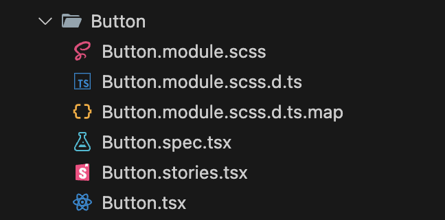
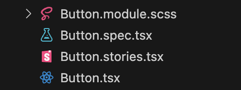
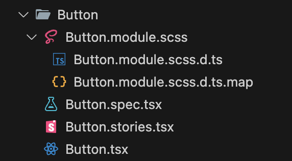

<!-- _backgroundColor: black -->
<!-- _color: white -->
<!-- @see https://marpit.marp.app/directives?id=apply-to-a-single-page-spot-directives-->

# 自分だけの「セカンドブレイン」を育もう

The space of a slide content will shrink to the right side.

---

# 背景

- `SECOND BRAIN（セカンドブレイン）　時間に追われない「知的生産術」`という本を読んだ
- 本の内容と自分の普段の行動が一致していて、ちょっとしたアハ体験だったのでもし、同じようなことを実践している方がいらっしゃったら共感したい
- 後述しますが、エンジニアに限らずいろんな職種で役に立つと思ったから

---

# セカンドブレインとは？

**[新しい知識を覚えるのではなく、どこかにまとめておいて、必要な時にすぐに取り出せるようにしておく行為のこと](https://biz.moneyforward.com/tax_return/basic/41247/)**

- Capture（収集）心に響くものをキープ
- Organize（整理）行動のための仕分け
- Distill（抽出）本質の発見
- Express（表現）成果をアウトプット

---

# 具体例

**[新しい知識を覚えるのではなく、どこかにまとめておいて、必要な時にすぐに取り出せるようにしておく行為のこと](https://biz.moneyforward.com/tax_return/basic/41247/)**

> 「あんまり覚えられないので、記憶を外部に置いている感じです。見れば思い出すから」とくるまさん。メモは自分なりに組み立てたメソッドのひとつだ。「反省点は出番の合間とかに相方とバーッと喋る。過程はメモせずに、ネタの大本を書き換えちゃいます」

---

<!-- _backgroundColor: black -->
<!-- _color: white -->
<!-- @see https://marpit.marp.app/directives?id=apply-to-a-single-page-spot-directives-->

# 自分はどうやって「セカンドブレイン」を育てているのか？

The space of a slide content will shrink to the right side.

---

# Capture（収集）心に響くものをキープ

**[Twitter で情報収集し Slack で一時保存するようにしています](https://biz.moneyforward.com/tax_return/basic/52338/)**

- ツイッターで技術者をフォローして TL に情報が流れるようにしている
- 140 文字でコンパクトに重要な情報がまとまっているので
- 有識者はどんな情報をウォッチしているのかトレンドを把握することができる
- 受動喫煙みたいなインプット

**参考記事**

- [アフター Twitter 時代の情報収集](https://levtech.jp/media/article/information-gathering-after-twitter/)

---

# 具体例

- Twitter で良さそうな情報を見つけたら Slack の個人チャンネルに投げています
- 退勤後や休日のまとまった時間をまとめて Notion にまとめています
- 対応完了後は ✅ スタンプを押して重複がないように工夫しています

---

# Organize（整理）行動のための仕分け

**注意点**

- Notion にまとめています
- 人によっては Qiita, Zenn といった技術記事としてまとめている方もいるかもしれません。

---

# 具体例

- Twitter で良さそうな情報を見つけたら Slack の個人チャンネルに投げています
- 退勤後や休日のまとまった時間をまとめて Notion にまとめています
- 対応完了後は ✅ スタンプを押して重複がないように工夫しています

---

# Distill（抽出）本質の発見

**簡単な具体例**

- VSCode の拡張機能 GraphQL の折りたたみ
- VSCode の拡張機能 VSCode Copilot

---

# Express（表現）成果をアウトプット

- 技術関連は Qiita, Zenn へアウトプットする
- それ以外は note, 静かなインターネットへアウトプットする
- 実務に落とし込む -> こちらについて深ぼっていきます

---

<!-- _backgroundColor: black -->
<!-- _color: white -->
<!-- @see https://marpit.marp.app/directives?id=apply-to-a-single-page-spot-directives-->

# 最近あった事例

The space of a slide content will shrink to the right side.

---

# トラブルシューティング\_02

- Q, 副業の収入額が本収入（所属している企業の収入）の 10%を超えた場合は事業所得で申請した方が良いのでしょうか？
- A, 青色申告（事業所得）で申請した方が良い。ただし赤字で誤魔化すのは税務署から睨まれやすいので注意する

**参考動画**

- [はじめてのかたでもわかる確定申告講座](https://peatix.com/event/3832108/view)

---

<!-- _backgroundColor: black -->
<!-- _color: white -->
<!-- @see https://marpit.marp.app/directives?id=apply-to-a-single-page-spot-directives-->

# まとめ

The space of a slide content will shrink to the right side.

---

