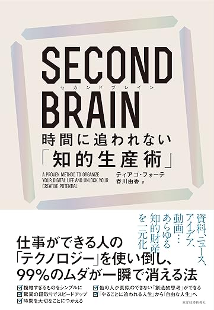

# 自分だけの「セカンドブレイン」を育もう

The space of a slide content will shrink to the right side.

# 背景・目的

- `SECOND BRAIN（セカンドブレイン）　時間に追われない「知的生産術」`を読んだ
- セカンドブレインを知ってもらい、体系化された形で定義されていることを共有したい
- 自分はどうやってセカンドブレインを育てているのか棚卸しをしたい

# セカンドブレインとは？

## 個人が情報やアイデアを整理・保存し、必要なときにすぐにアクセスできるようにするための外部の情報管理システムのこと

記憶や思考を補助する「第 2 の脳」として機能し、主にデジタルツールを使って構築する

- ノートアプリ: Notion、Evernote、Obsidian、Roam Research
- タスク管理ツール: Todoist、Trello
- クラウドストレージ: Google Drive、Dropbox

# 具体例

お笑い芸人「令和ロマン」の事例

> 「あんまり覚えられないので、記憶を外部に置いている感じです。見れば思い出すから」とくるまさん。メモは自分なりに組み立てたメソッドのひとつだ。「反省点は出番の合間とかに相方とバーッと喋る。過程はメモせずに、ネタの大本を書き換えちゃいます」

**参考記事**

- いい仕事ってなんだろう？／高比良くるま（https://popeyemagazine.jp/post-160650/ ）

# セカンドブレインとは？

## 個人が情報やアイデアを整理・保存し、必要なときにすぐにアクセスできるようにするための外部の情報管理システムのこと

CODE というフレームワークを使ってセカンドブレインを育てる

- Capture（収集）
- Organize（整理）
- Distill（抽出）
- Express（表現）

# CODE で「セカンドブレイン」を育む

The space of a slide content will shrink to the right side.

# Capture（収集）

## Twitter で情報収集、Slack で一時保存

- エンジニアをフォローして TL に技術情報が流れるようにしている
- 140 文字で投稿されているので要点だけ投稿されているケースが多い
- 心に響くものをキープする場として Slack を採用

**参考記事**

- アフター Twitter 時代の情報収集（https://levtech.jp/media/article/information-gathering-after-twitter/ ）

# 具体例

- Twitter で心に響く投稿があれば Slack の個人チャンネルにキープする
- 退勤後や休日のまとまった時間を使って Notion にまとめる（後述の Organize に該当）
- 既読後は ✅ スタンプを押して読み忘れがないように工夫している

# Organize（整理）

## 情報管理システムとして Notion を採用、言語単位で整理

- 前職は ドキュメントツールとして Notion を使っていたので、その名残で Notion を採用している
- PARA の法則で仕分けする事例もあるが、自体は単純に page をつくっているだけなので我流
- 横断するような事柄は arsaga.js で整理している

# Distill（抽出）

## 収集した記事に対してエグゼクティブサマリーをつける

- 後で見返す時、概要を掴めるように箇条書きをしてまとめておく
- 他人の記事の内容にコメントをする
- 実務で学んだことにコメントをする

※ 記事に対して個人の意見が多分に含まれているため省略。画面共有で説明

# Express（表現）

## 実務 or 記事として成果をアウトプットする

- 実務でアウトプットする
- 技術に関する内容は `Qiita`, `Zenn` でアウトプットする
- それ以外は `note`, `静かなインターネット`でアウトプットする

-> 全てをアウトプットできるわけではないので Distill で留まってしまうことが多い次の

# まとめ

The space of a slide content will shrink to the right side.

---

- **セカンドブレインとは？**

  - 個人が情報やアイデアを整理・保存し、必要なときにすぐにアクセスできるようにするための外部の情報管理システムのこと

- **CODE というフレームワークでセカンドブレインを育てる**
- **職種関係なく自分にあった方法を試行錯誤する必要がある**
  - フレームワークは銀の弾丸ではない

自分だけの「セカンドブレイン」を育もう

<!--  -->

# ご清聴ありがとうございました！

The space of a slide content will shrink to the right side.

---

[MEMO]言い方に問題はあるが「受動喫煙みたいなインプット」っていうのが的を得ているなあと

[MEMO]振り返ってみると思い当たる節はいくつかあった -> 中学の頃のサッカーノート

「最近あった事例」を追加する？
