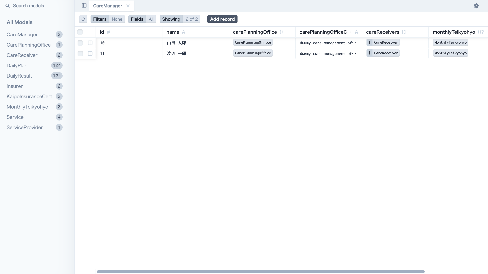
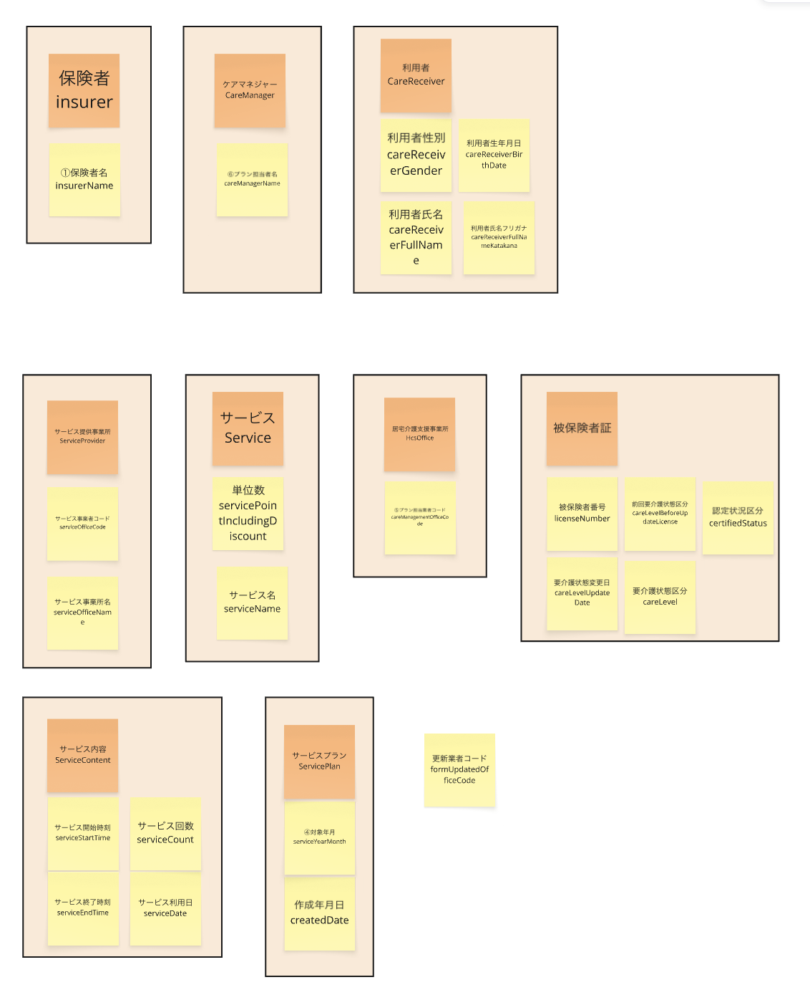
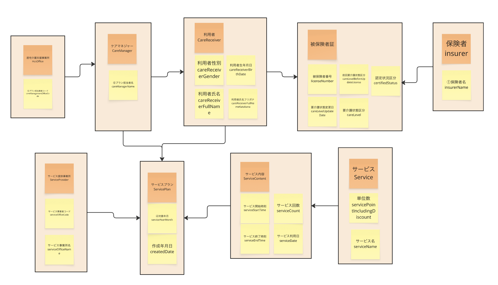
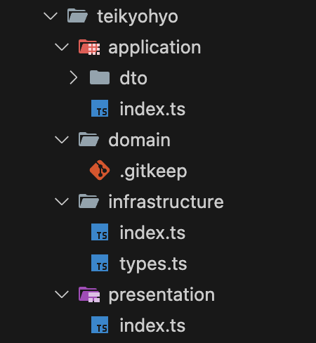

# インターンシップ発表会（泉澤俊）

2025/09/12

# アジェンダ

- プロジェクトの概要と目的
- 技術選定
- 実装の振り返り
  - モデリング
  - ディレクトリ構成
  - CSV to JSON
  - 計算処理の効率化
- 今後の展望

# プロジェクトの概要と目的

〇〇の開発に着手しました。
1-3まで完了しています
メインはバックエンドの開発について取り上げます

# 技術選定

バックエンドに関する技術スタックの選定理由について触れていきます

# 全体の構成

- **TypeScript**: 全体の言語基盤
- **Hono**: Webサーバー/ルーティング
- **Prisma**: ORM（データベース操作）
- **SQLite**: データ永続化


# TypeScript

- 採用理由
  - フロントエンドでTypeScriptに慣れていたため、学習コストを抑えて開発できる
  - 開発体験の一貫性（フロントエンドとバックエンドで同じ言語を使える）
- 比較検討した技術
  - Kotlin  
    - 実務ではKotlinも扱っているがTypeScriptに比べると知見が足りず今回は見送り

<!-- hint! -> VSCode（既に拡張機能が入っていて開発体験が良いのでVSCodeで開発できるものを選定したかった） -->

# Hono

- 採用理由  
  - TypeScriptとの親和性が高く、シンプルで高性能、学習コストが低い
- 比較検討した技術  
  - Express.js  
    - TypeScriptとの型安全性が低い  
  - Nest.js  
    - 機能が豊富だが学習コストが高い


# Prisma

- 採用理由  
  - 型安全性が高く、ドキュメントやツール（ex: Prisma Studio）が充実している
- 比較検討した技術  
  - TypeORM  
    - 型安全性が低い  
  - Drizzle
    - ドキュメントやツールが少ない

# Prisma Studio


# SQLite

- 採用理由  
  - 手軽さと開発効率の高さ。本番環境でのスケーラビリティや複雑な機能が不要だったため
- 比較検討した技術  
  - MySQL, PostgreSQL
    - 本番運用やスケールが必要な場合は有力だが、今回は要件に合わなかった


# POINT

技術選定は「何を達成したいか」という目的によって大きく変わります。  
今回は、**学習コストの低さ**や**開発体験の一貫性**、**型安全性**、**開発効率**を重視しました。  

そのため、既存知見を活かせるTypeScriptや、シンプルで高速なHono、型安全性とツールが充実したPrisma、手軽に扱えるSQLiteを選択しています。

<!-- 一方で、スケーラビリティや複雑な業務要件が求められる場合は、より高度なフレームワークやデータベースを選ぶ必要があります。   -->
技術選定は「目的」「要件」「チームの知見」「将来の拡張性」など、複数の観点から総合的に判断することが重要です。

# 実装の振り返り

インターンシップ課題に取り組んでみての振り返りをしていきます

# モデリング

## 振り返り
エンティティのグループ化や関連付けの作業は何度も試行錯誤を繰り返し、一度で完成することはありませんでした。実際に手を動かしてみて、動かして壊してを繰り返すことで、より現実的なモデルに近づけることができました。

## 作業の流れ

- エンティティや関係性をグループ化・整理
- ER図に落とし込む
- 実際のスキーマや型定義に反映する

---

## エンティティの整理（1回目）




---

## エンティティの関連付け（1回目）



---

## ER図の作成（1回目）
実装を進める中で予定実績のテーブルを作る必要性が出てきたので後ほど修正対応が入っています。


---

## ER図の作成（n回目）

最終的なER図は以下の通りになりました。別途PDF添付します。


# モデリング

## POINT

**Miro**というデジタルホワイトボードを使うと作業のログが残るので後から振り返りやすく、チームでの共有や修正も簡単です。

割と実装に入ってからモデリングが足りないことに気づき、後戻りする場面もありましたが、早い段階で気づけたことで大きな手戻りにはならずに済みました。

# ディレクトリ構成

## 振り返り

コードの見通しをよくするために、**3層アーキテクチャ**（プレゼンテーション層、ビジネスロジック層、データアクセス層）を意識し、**ドメイン駆動設計**（DDD）の考え方を参考にディレクトリを分割しました。これにより、役割ごとに責任が明確になり、保守性や拡張性が高まりました。


# ディレクトリ構成

## 具体例

**presentation**: プレゼンテーション層
**application**: ビジネスロジック層
**domain**: ビジネスロジック層
**infrastructure**: データアクセス層

※ドメイン駆動設計（DDD）の考え方を参考に4階層に分けているものの今回、domainは使っていない



# ディレクトリ構成

## POINT

3層アーキテクチャやドメイン駆動設計の考え方を意識してディレクトリを分割することで、  
- 役割ごとに責任が明確になる  
- 変更や追加がしやすくなる  
- チーム開発でも衝突が減る

など、長期的な開発において大きなメリットがあります。

# CSV to JSON

## 振り返り

課題1.1でCSVインポートの実装があった。CSVファイルを自力でパースする際は、落とし穴が多いためPapaparseというライブラリを使用しました。

# CSV to JSON

## 具体例

- カンマや改行
  - CSVは「,」で区切られたデータ形式ですが、データ自体にカンマや改行が含まれている場合がある
- クォーテーション
  - データにダブルクォーテーション（"）が含まれている場合、囲み方やエスケープのルールを正しく扱わないと、値が意図しない形で分割される
- ヘッダーの有無
  - 1行目がヘッダーかどうか、ヘッダーの有無によってデータの扱い方が変わるため考慮が必要になる

# CSV to JSON

## Papaparse

- 採用理由  
  - Reactとの依存関係を減らし、バンドルサイズを軽くするため  
  - 純粋なCSV to JSONのパース処理を行いたかったため、コアライブラリを採用

- 比較検討した技術  
  - react-papaparse  
    - React依存があり、バンドルサイズが大きくなるため今回は見送り

# CSV to JSON

## POINT

自力でパースする場合は多くのエッジケースを考慮する必要があり、時間と労力がかかります。そのため、信頼できるライブラリの利用を検討するのも良い選択肢です。


# 計算処理の効率化

## 振り返り

フラットな状態からデータ保存するために以下の多重構造に整形する必要があったので、Mapというデータ構造で計算量に気をつけた実装を行いました。

- 利用者（CareReceiver）
  - サービス（Service）
    - 日付ごとの計画・実績（Plans, Results）

※ O(N)->O(1), n²->2n のような表現がされることもあります。

---

## O(1)の例(ループ処理が最小限になっている例)

```ts
export const createImportCommand = (
  data: ServicePlanCsvImport[],
): CreateImportCommand[] => {
  const careReceiverMap: CareReceiverMap = new Map();

  for (const d of data) {
    const { serviceName, serviceCount, serviceDate, careReceiverFullName } = d;

    // NOTE: careReceiverMapに利用者名が存在しない場合は新規作成する
    if (!careReceiverMap.has(careReceiverFullName)) {
      careReceiverMap.set(careReceiverFullName, new Map());
    }

    const _careReceiverMap = careReceiverMap.get(careReceiverFullName);
    if (!_careReceiverMap) throw new Error("care receiver map not found");

    // NOTE: serviceMapにサービス名が存在しない場合は新規作成する
    if (!_careReceiverMap.has(serviceName)) {
      _careReceiverMap.set(serviceName, { ...d, dateMap: new Map() });
    }
    const _serviceMap = _careReceiverMap.get(serviceName);
    if (!_serviceMap) throw new Error("service map not found");

    _serviceMap.dateMap.set(serviceDate, {
      count: serviceCount,
      date: serviceDate,
    });
  }

  const results = Array.from(careReceiverMap, ([_, serviceMap]) => {
    return Array.from(
      serviceMap,
      ([_, { serviceYearMonth, dateMap, ...rest }]) => {
        const { dailyPlan, dailyResult } = getDailyPlansAndResults({
          serviceYearMonth,
          dateMap,
        });

        return { serviceYearMonth, dailyPlan, dailyResult, ...rest };
      },
    );
  });

  return results.flat(2); // 2次元配列を1次元に変換する
};
```

---

## O(N)の例(ループ処理がn回になっている例)

```ts
export const createImportCommand = (
  data: ServicePlanCsvImport[],
): CreateImportCommand[] => {
  const results: CreateImportCommand[] = [];

  // 利用者ごとに処理（毎回全データをfilter）
  data.forEach(d => {
    const careReceiverData = data.filter(item => 
      item.careReceiverFullName === d.careReceiverFullName
    );
    
    // サービスごとに処理（また全データをfilter）
    careReceiverData.forEach(cd => {
      const serviceData = careReceiverData.filter(item => 
        item.serviceName === cd.serviceName
      );
      
      // 重複チェックも毎回全配列を検索
      const exists = results.some(r => 
        r.careReceiverFullName === cd.careReceiverFullName && 
        r.serviceName === cd.serviceName
      );
      
      if (!exists) {
        const { dailyPlan, dailyResult } = getDailyPlansAndResults({
          serviceYearMonth: cd.serviceYearMonth,
          dateMap: new Map(serviceData.map(s => [s.serviceDate, { count: s.serviceCount, date: s.serviceDate }]))
        });
        
        results.push({ ...cd, dailyPlan, dailyResult });
      }
    });
  });

  return results;
};
```

# 計算処理の効率化

## POINT

（JavaScriptの場合）MapやSetなどのデータ構造を活用することで、計算量をO(N)からO(1)に改善できる場合があります。「今の実装は本当に効率的か？」と一度立ち止まって考える習慣を持つことで、より良いコードが書けるようになります。

効率化は後からでもできる部分ですが、早い段階で意識できると、手戻りやバグの防止にもつながります。

# 今後の展望

追加実装する場合、着手したい内容について触れます

# 今後の展望

- **バックエンドバリデーションの実装**  
  入力値の検証を厳密に行うことで、予期しないデータの混入やバグを未然に防ぎ、より安全なAPI設計を目指します。  
  型安全なバリデーションを導入することで、開発効率や保守性も向上します。

- **テスト実装**  
  ユニットテストや結合テストを充実させることで、リファクタや機能追加時の品質を担保しやすくなります。 テストコードがあることで、安心して開発を進められる環境を整えたいと考えています。


# ご清聴ありがとうございました！
