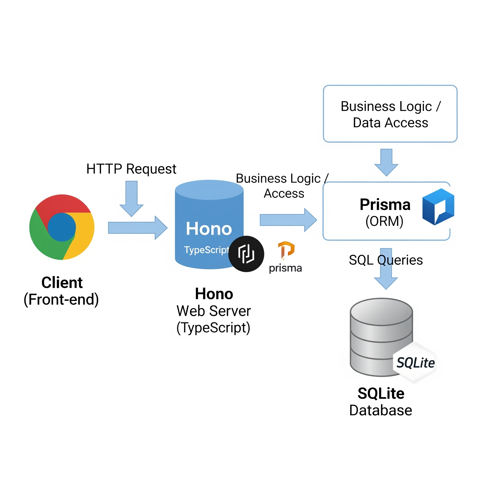

# インターンシップ発表会（泉澤俊）

2025/09/12

# アジェンダ

- プロジェクトの概要と目的
- 技術選定
- 実装
  - モデリング
  - ディレクトリ構成
  - CSV to JSON
  - 2n vs n2乗
- 今後の展望

# プロジェクトの概要と目的

〇〇の開発に着手しました。
1-3まで完了しています
メインはバックエンドの開発について取り上げます

# 技術選定

バックエンドに関する技術スタックの選定理由について触れていきます

# TypeScript

- 採用理由
  - フロントエンドでTypeScriptに慣れていたため、学習コストを抑えて開発できる
  - 開発体験の一貫性（フロントエンドとバックエンドで同じ言語を使える）
- 比較検討した技術
  - Kotlin  
    - 実務ではKotlinも扱っているがTypeScriptに比べると知見が足りず今回は見送り

<!-- hint! -> VSCode（既に拡張機能が入っていて開発体験が良いのでVSCodeで開発できるものを選定したかった） -->

# Hono

- 採用理由  
  - TypeScriptとの親和性が高く、シンプルで高性能、学習コストが低い
- 比較検討した技術  
  - Express.js  
    - TypeScriptとの型安全性が低い  
  - Nest.js  
    - 機能が豊富だが学習コストが高い


# Prisma

- 採用理由  
  - 型安全性が高く、ドキュメントやツール（ex: Prisma Studio）が充実している
- 比較検討した技術  
  - TypeORM  
    - 型安全性が低い  
  - Drizzle
    - ドキュメントやツールが少ない

---

Prisma Studio


# SQLite

- 採用理由  
  - 手軽さと開発効率の高さ。本番環境でのスケーラビリティや複雑な機能が不要だったため
- 比較検討した技術  
  - **MySQL, PostgreSQL**  
    - 本番運用やスケールが必要な場合は有力だが、今回は要件に合わなかった


# POINT



技術選定は目的によって変わる

# 実装


# モデリング

ツールとしてはMiroを使った。エンティティをグループ化し関連をつける作業は何回か往復した。一発でモデリングは完成しなかった。

- Miroなどでエンティティや関係性をグループ化・整理
- ER図やクラス図に落とし込む
- 実際のスキーマや型定義に反映する

---

[1回目]エンティティの整理


---

[1回目]関連付け


---

[1回目]ER図の作成
実装を進めて予実のテーブルを作る必要に気づいて修正


---

最終的にはこちらで実装


# モデリング（POINT）

割と実装に入ってからモデリングが足りないことに気づき、後戻りする場面もありましたが、早い段階で気づけたことで大きな手戻りにはならずに済みました。

# ディレクトリ構成

コードの見通しをよくするために、3層アーキテクチャ（プレゼンテーション層、ビジネスロジック層、データアクセス層）を意識し、ドメイン駆動設計（DDD）の考え方を参考にディレクトリを分割しました。これにより、役割ごとに責任が明確になり、保守性や拡張性が高まりました。


# ディレクトリ構成（具体例）

presentation: プレゼンテーション層
application: ビジネスロジック層
domain: ビジネスロジック層
infrastructure: データアクセス層

※ドメイン駆動設計（DDD）の考え方を参考に4階層に分けているものの今回、domainは使っていない


# CSV to JSON


課題1.1でCSVインポートの実装があった。CSVファイルを自力でパースする際は、落とし穴が多い。

# CSV to JSON（具体例）

- カンマや改行
  - CSVは「,」で区切られたデータ形式ですが、データ自体にカンマや改行が含まれている場合がある
- クォーテーション
  - 
- 文字エンコーディング
  -
- ヘッダーの有無


# CSV to JSON（POINT）

自力でパースする場合は多くのエッジケースを考慮する必要があり、非常に多くの時間と労力がかかる

<b>ライブラリを使おう！</b>

# Papaparse

比較対象: react-papaperse

Reactとの依存関係を減らしバンドルサイズを軽くするため。純粋なCSV to JSONのparseのために利用したくコアライブラリを採用しました。


# O(N)からO(1)にする

計算量を意識して、処理の効率化（O(N)→O(1)）を行った

1-1のテストを通すために、データ構造を[CareReceiver[Service[Plan, Results]]]の形にする必要がありました。  
最初はループ処理が複雑になりがちでしたが、Mapを活用して効率的にデータを集約することで、計算量をO(N)からO(1)に改善できました。  
このような実装の際は、ループやネストが増えて複雑になっていないか、都度見直すことが重要だと感じました。

フラットな状態からデータ保存するために多重構造に上で計算量に気を使った

- 利用者（CareReceiver）
  - サービス（Service）
    - 日付ごとの計画・実績（Plans, Results）


---

多重ループが発生している例

```ts
export const createImportCommand = (
  data: ServicePlanCsvImport[],
): CreateImportCommand[] => {
  const careReceiverMap: CareReceiverMap = new Map();

  for (const d of data) {
    const { serviceName, serviceCount, serviceDate, careReceiverFullName } = d;

    // NOTE: careReceiverMapに利用者名が存在しない場合は新規作成する
    if (!careReceiverMap.has(careReceiverFullName)) {
      careReceiverMap.set(careReceiverFullName, new Map());
    }

    const _careReceiverMap = careReceiverMap.get(careReceiverFullName);
    if (!_careReceiverMap) throw new Error("care receiver map not found");

    // NOTE: serviceMapにサービス名が存在しない場合は新規作成する
    if (!_careReceiverMap.has(serviceName)) {
      _careReceiverMap.set(serviceName, { ...d, dateMap: new Map() });
    }
    const _serviceMap = _careReceiverMap.get(serviceName);
    if (!_serviceMap) throw new Error("service map not found");

    _serviceMap.dateMap.set(serviceDate, {
      count: serviceCount,
      date: serviceDate,
    });
  }

  const results = Array.from(careReceiverMap, ([_, serviceMap]) => {
    return Array.from(
      serviceMap,
      ([_, { serviceYearMonth, dateMap, ...rest }]) => {
        const { dailyPlan, dailyResult } = getDailyPlansAndResults({
          serviceYearMonth,
          dateMap,
        });

        return { serviceYearMonth, dailyPlan, dailyResult, ...rest };
      },
    );
  });

  return results.flat(2); // 2次元配列を1次元に変換する
};
```

---

多重ループが発生している例

```ts
export const createImportCommand = (
  data: ServicePlanCsvImport[],
): CreateImportCommand[] => {
  const results: CreateImportCommand[] = [];

  // 利用者ごとに処理（毎回全データをfilter）
  data.forEach(d => {
    const careReceiverData = data.filter(item => 
      item.careReceiverFullName === d.careReceiverFullName
    );
    
    // サービスごとに処理（また全データをfilter）
    careReceiverData.forEach(cd => {
      const serviceData = careReceiverData.filter(item => 
        item.serviceName === cd.serviceName
      );
      
      // 重複チェックも毎回全配列を検索
      const exists = results.some(r => 
        r.careReceiverFullName === cd.careReceiverFullName && 
        r.serviceName === cd.serviceName
      );
      
      if (!exists) {
        const { dailyPlan, dailyResult } = getDailyPlansAndResults({
          serviceYearMonth: cd.serviceYearMonth,
          dateMap: new Map(serviceData.map(s => [s.serviceDate, { count: s.serviceCount, date: s.serviceDate }]))
        });
        
        results.push({ ...cd, dailyPlan, dailyResult });
      }
    });
  });

  return results;
};
```


# 今後の展望

- zodを用いたバックエンドバリデーションの実装
- テスト実装


# ご清聴ありがとうございました！
